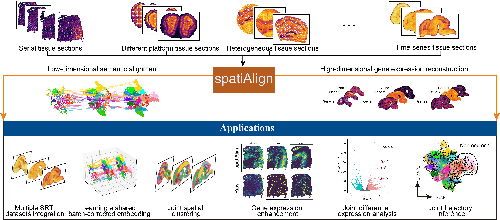
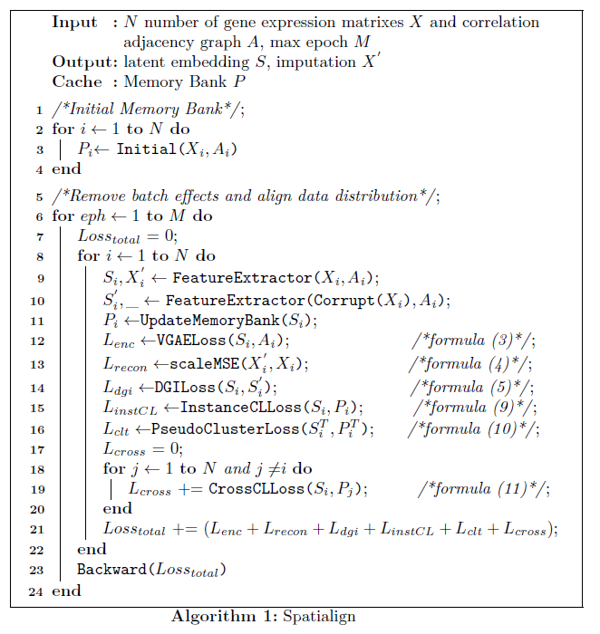

.. spatiAlign documentation master file, created by
   sphinx-quickstart on Tue Nov 21 09:39:34 2023.
   You can adapt this file completely to your liking, but it should at least
   contain the root `toctree` directive.

Welcome to spatiAlign's documentation!
======================================

.. toctree::
   :maxdepth: 1
   :caption: Contents
   
   Installation
   spatialign
   Tutorial-1-simulate-datasets
   Tutorial-2-Integrate-datasets-measured-by-different-platforms

Overview
========

Integrative analysis of spatially resolved transcriptomics datasets empowers a deeper understanding of complex biological systems. However, integrating multiple tissue sections presents challenges for batch effect removal, particularly when the sections are measured by various technologies or collected at different times. Here, we propose spatiAlign, an unsupervised contrastive learning model that employs the expression of all measured genes and the spatial location of cells, to integrate multiple tissue sections. It enables the joint downstream analysis of multiple datasets not only in low-dimensional embeddings but also in the reconstructed full expression space. In benchmarking analysis, spatiAlign outperforms state-of-the-art methods in learning joint and discriminative representations for tissue sections, each potentially characterized by complex batch effects or distinct biological characteristics. Furthermore, we demonstrate the benefits of spatiAlign for the integrative analysis of time-series brain sections, including spatial clustering, differential expression analysis, and particularly trajectory inference that requires a corrected gene expression matrix.

